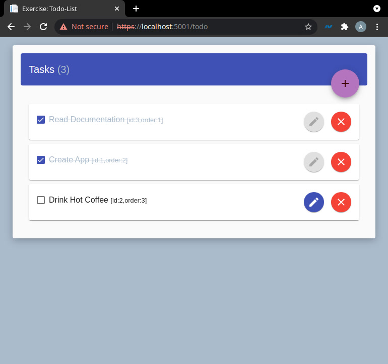
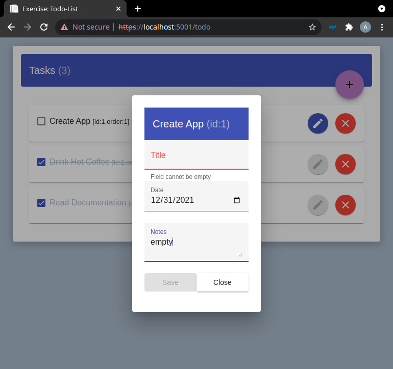

# TODO list

Todo List app consisting Angular and .NET Core

| Todo list | Edit menu |
|---|---|
|  |  |

## Run code using CLI

If you'd like to run and test the app on your local machine.
There are some steps required to be done before you deploy it locally.

### Install dependencies
- In the project folder run: `dotnet restore`
- In the **/src/ClientApp** folder run: `npm ci`

### Run the solution
- In the project folder run: `dotnet run`

### Run the solution watching changes
- In the project folder run: `dotnet watch run`

> You can access the application on `localhost:5001`
