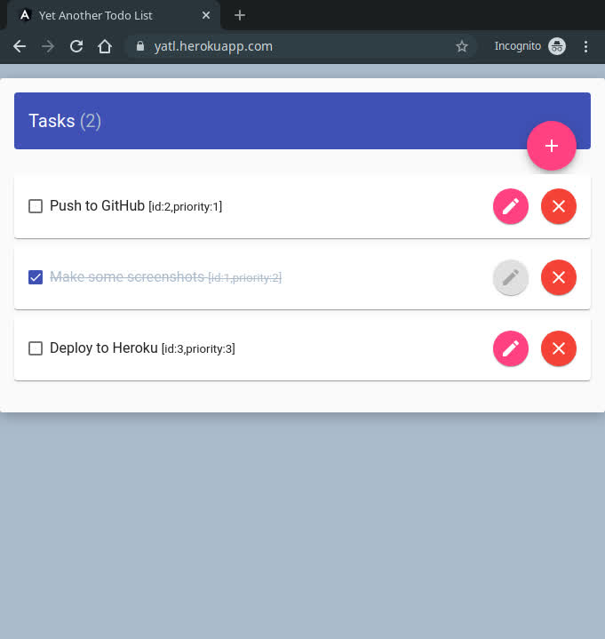
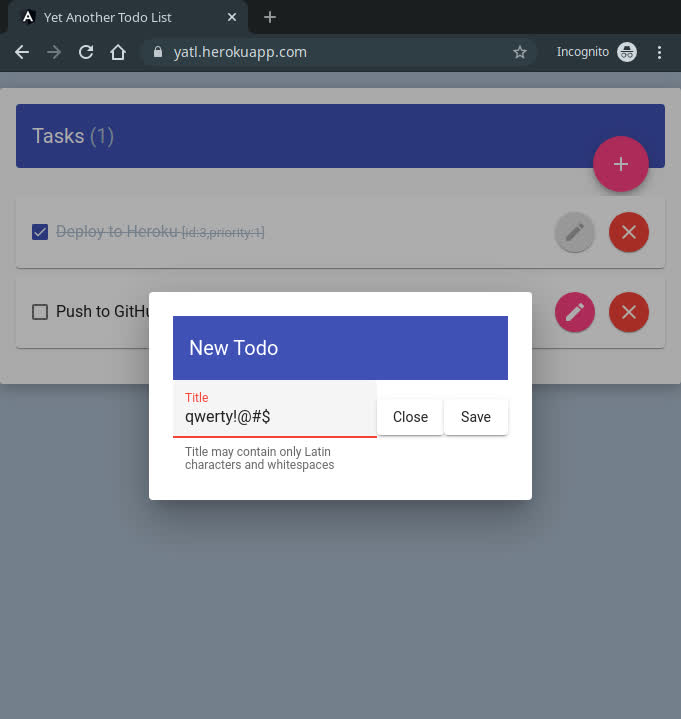

# Yet Another Todo List
Todo List app consisting Angular and Spring Boot.

Check out the [Live Version](https://yatl.herokuapp.com/) hosted on Heroku.

| List with Drag&Drop items | Menu to create/edit a Todo |
|---|---|
|  |  |

## Built with
### Front-End:
- Angular 9
- Angular Material UI
- Angular Flex-Layout
### Back-End:
- Spring Boot 2.2
- Spring Data JPA
- Maven
- Lombok
- JUnit
- Log4j2
- Postgres

## Deploy
If you'd like to run the project on your local machine.
There are some steps required to be done before you'd deploy it locally.
